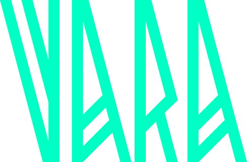

# Vara Network 简介

---

## Web3’s Paradigm Shift

 

<pba-cols>

<pba-col style="font-size:smaller">

 

https://vara.network

</pba-col>

<pba-col>

- 支持并行计算的高性能 L1
- 智能合约引擎 Gear Protocol
- 基于 Substrate 构建 (NPoS)
- 主网于 2023 年 Q3 启动

</pba-col>

</pba-cols>

---

## Gear Protocol

 

<pba-cols>

<pba-col style="font-size:smaller">

 

https://github.com/gear-tech/gear

</pba-col>

<pba-col>

- Actor Model
- 异步消息
- 并行处理
- 跨区块执行

</pba-col>

</pba-cols>

---

<pba-cols>

<pba-col>

## Easy to Develop

</pba-col>

<pba-col>

## Easy to Scale

</pba-col>

</pba-cols>

---

## Applications

 

<pba-flex center>

- Decentralized Finance (DeFi)
- Non-fungible Tokens (NFTs)
- Decentralized Autonomous Orgs (DAOs)
- Fully On-Chain Games (FOCGs)
- ...

</pba-flex>

---

## Rust ❤️ WebAssembly

 

---

## 开发者资源

 

<pba-flex center>

- 文档中心 - https://wiki.gear-tech.io
- 标准库文档 - https://docs.gear.rs/gstd
- 区块浏览器 - https://vara.subscan.io
- Gear IDEA - https://idea.gear-tech.io
- Gear Academy - https://academy.gear.foundation

</pba-flex>