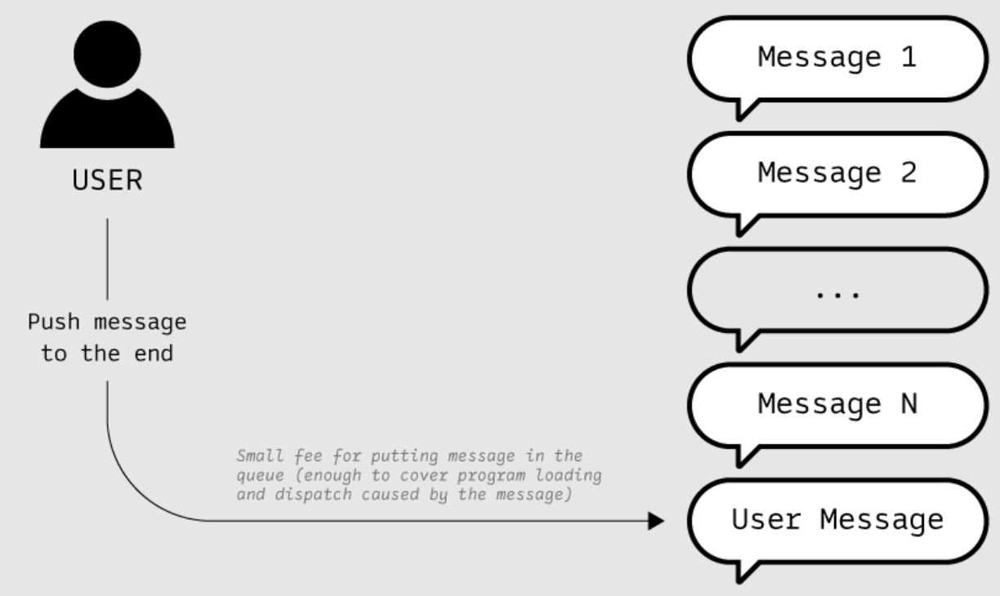

# 核心概念

---

## Actor Model

Gear Protocol 额外保证了消息的顺序

Notes:

一切皆 Actor

每个 Actor 封装了自己的私有状态和行为

它们无法直接访问其它 Actor 内部状态, 只能通过异步消息进行通信

这意味着发送消息后，Actor 不需要等待这条消息被其他的 Actor 处理，

它可以继续执行其他业务逻辑，直到收到相应的回复

在 Actor 处理收到的消息时，它可以:

回复这条消息，向其它 Actor 发送消息

创建新的 Actor

以及改变其内部状态

使用 Actor Model 可以简化合约间的异步通信，

在传统 Actor Model 的基础上，Gear Protocol 额外保证了异步消息的顺序

让合约能按照消息被发送的顺序对消息进行处理，产生具有确定性的执行结果

---

## Actor

 

<pba-cols>

<pba-col>

- 用户账户 - User Accounts 
- 一般合约 - Programs
- 内置合约 - Built-in Actors

 

每个 Actor 都有各自的地址

</pba-col>

<pba-col>

- 用户 <=> 用户
- 用户 <=> 合约
- 合约 <=> 合约

 

发送给用户的消息在 Mailbox 中

</pba-col>

</pba-cols>

---

## Program

 

<pba-cols>

<pba-col>

</pba-col>

<pba-col>

- State
- Metadata
- Entrypoint
  - init - 初始化 State
  - state - 读取 State
  - handle - 处理消息
  - handle_reply - 处理回复

</pba-col>

</pba-cols>

Notes:

Metadata holds information about I/O types to init, meta_state, and handle

State holds variables necessary for business logic

init() function performs one-time upload tasks like initializing the state (Active/Terminated)

meta_state() allows to read the state feelessly (gas-free) via querying

handle() defines primary logic based on messages received from the outside world and updates the state

handle_reply() defines business logic for receiving messages back as a response from other contracts (and allows for async processing)

---

## Weight / Gas / Currency

 

<pba-flex left>

- 1 Weight = 10^-12 秒计算时间
- 1 Gas = 1 Weight
- 1 VARA = 10^12 Gas

 

单个区块消耗的 Gas 上限为 750 000 000 000 (0.75 VARA)

相当于在标准硬件上 750ms 的执行时间

 

- 合约可预留 Gas 用于在未来执行某些任务
- 用户可使用 Gas Voucher 支付特定合约 Gas 费

</pba-flex>

---

## Message

 

<pba-cols>

<pba-col>

- 转账
- 合约部署
- 合约调用
- ...

 

一切行为都可以通过消息来表示

</pba-col>

<pba-col>

- id
- source - Sender 地址
- destination - Receiver 地址
- gas_limit - Gas 费上限
- value - 金额 (单位: Gas)
- payload - 消息内容 (SCALE)

</pba-col>

</pba-cols>

---

## Global Message Queue

 

<pba-cols>

<pba-col>

Enqueue

</pba-col>

<pba-col>

Dispatch

</pba-col>

</pba-cols>

---

## Parallel Message Processing

 

