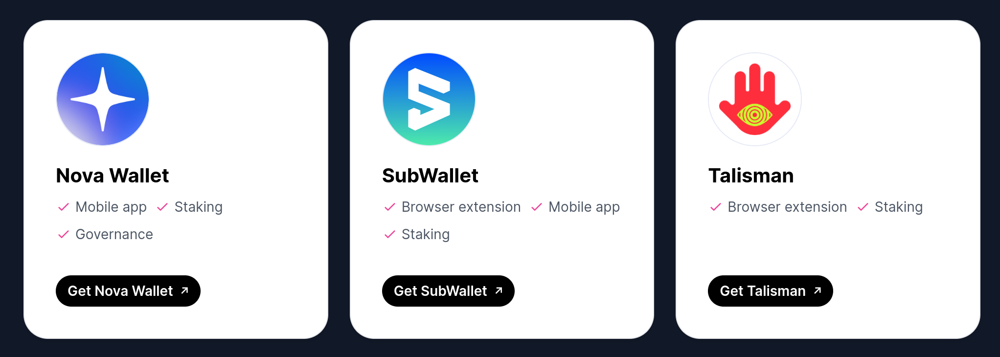
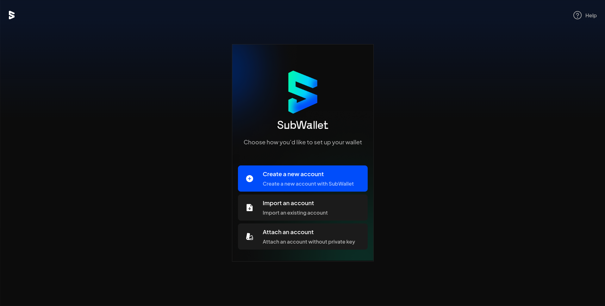
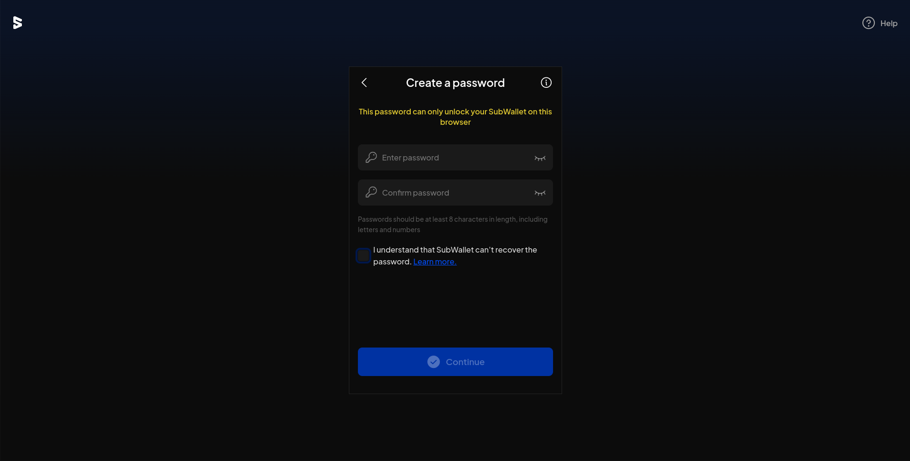
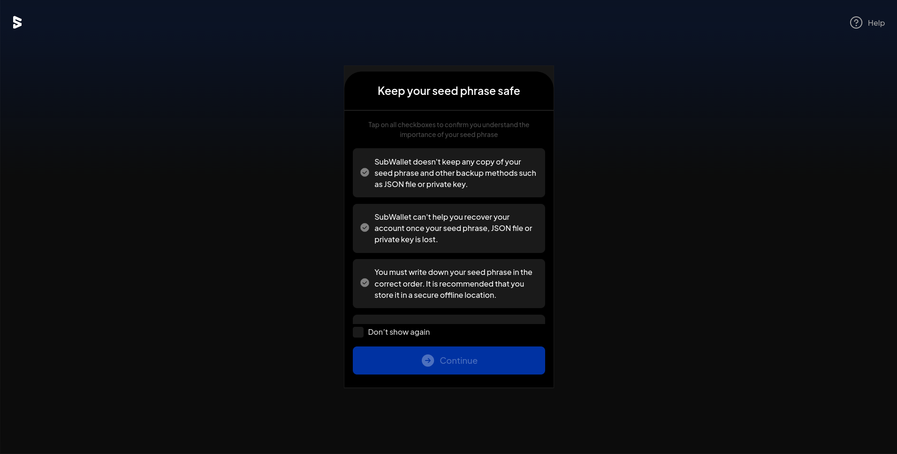
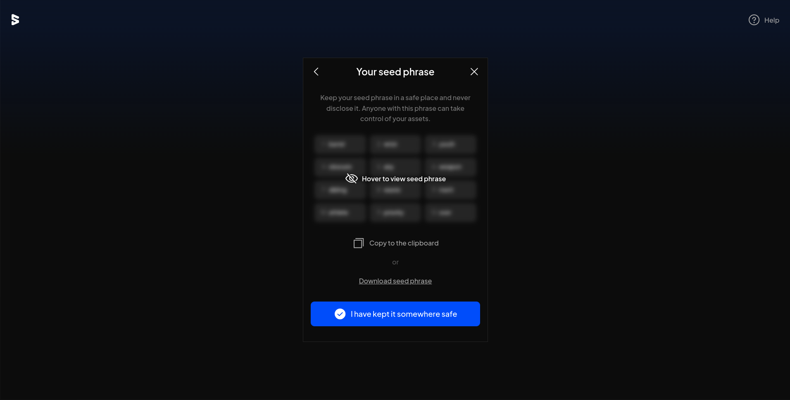
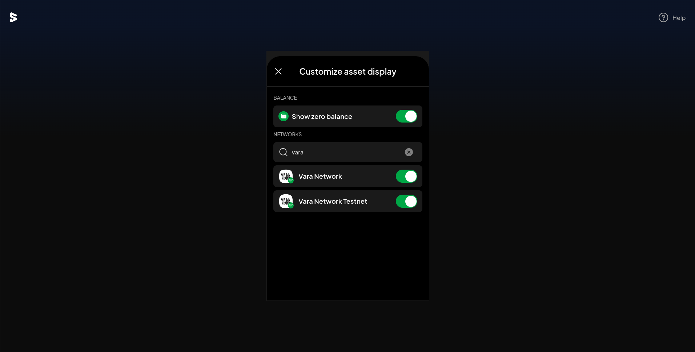
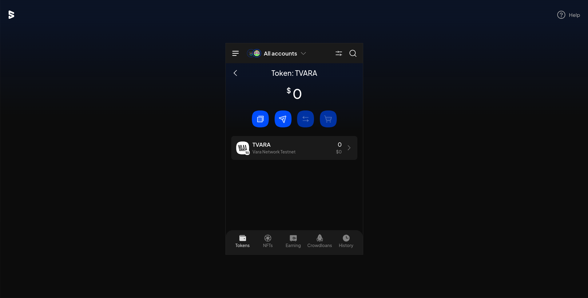

# 地址格式 & 钱包使用

---

## 密码学签名方案

<pba-flex left>

支持多种数字签名算法 (DSA)

<br/>

- __Sr25519__ (默认)
- Ed25519
- ECDSA (over secp256k1)

<br/>

账户地址派生自公钥，可包含额外的上下文信息
<!-- .element: class="fragment" data-fragment-index="1" -->

Notes:
  
Vara 支持使用多种数字签名算法对交易进行签名

大部分钱包默认都使用 sr25519 生成公私钥对

其中私钥用于签名，公钥用于验签

与其他两种算法相比，sr25519 对相同的内容重复签名，每次结果也会不一样

不论使用哪一种签名算法，账户地址都应该具有相同的长度 256 比特，

所以 sr25519 与 ed25519 可以直接使用 32 字节的公钥作为 account id
    
而 ECDSA 的公钥长度为 33 字节，需要经过哈希得到账户地址

也可以将账户地址进行编码，让它变得对用户更友好

 </pba-flex>

---

## 账户格式

<pba-flex left>

```bash
$ gear key generate --network vara --scheme sr25519
```
    
<br/>
    
```yaml
Secret phrase:       //Alice
  Network ID:        vara
  Public key (hex):  0xd43593c715fdd31c61141abd04a99fd6822c8558854ccde39a5684e7a56da27d
  Account ID:        0xd43593c715fdd31c61141abd04a99fd6822c8558854ccde39a5684e7a56da27d
  Public key (SS58): kGkLEU3e3XXkJp2WK4eNpVmSab5xUNL9QtmLPh8QfCL2EgotW
  SS58 Address:      kGkLEU3e3XXkJp2WK4eNpVmSab5xUNL9QtmLPh8QfCL2EgotW
```
<!-- .element: class="fragment" data-fragment-index="1" -->
    
<br/>
    
- hex<!-- .element: class="fragment" data-fragment-index="2" -->
- SS58 = base58Encode( context | hex | checksum ) <!-- .element: class="fragment" data-fragment-index="3" -->
    
</pba-flex>

---

## 示例: SS58 地址解码 (Python)

<pba-flex left>

```python
>>> import base58
>>> base58.b58decode("kGkLEU3e3XXkJp2WK4eNpVmSab5xUNL9QtmLPh8QfCL2EgotW").hex()
```

<br/>

```text
'6240 d43593c715fdd31c61141abd04a99fd6822c8558854ccde39a5684e7a56da27d 05eb'
 ^    ^                                                                ^
 ctx  pubkey                                                           chksum
```
<!-- .element: class="fragment" data-fragment-index="1" -->

</pba-flex>

---

## 示例: SS58 地址编码 (JavaScript)

<pba-flex left>

```typescript
> import { encodeAddress } from "npm:@gear-js/api"
> encodeAddress(
   "0xd43593c715fdd31c61141abd04a99fd6822c8558854ccde39a5684e7a56da27d",
   137, // Vara Network prefix (https://github.com/paritytech/ss58-registry)
  )
```
    
<br/>

```text
"kGkLEU3e3XXkJp2WK4eNpVmSab5xUNL9QtmLPh8QfCL2EgotW"
```
<!-- .element: class="fragment" data-fragment-index="1" -->

</pba-flex>

---

## 使用场景

<pba-flex left>

构造随机地址:

```rust
let addr_1 = gstd::actor_id!(
  "0x0000000000000000000000000000000000000000000000000000000000000001");

let addr_2 = gstd::actor_id!(
  "0x0000000000000000000000000000000000000000000000000000000000000002");

assert_ne!(addr_1, addr_2, "we are testing that the addrs are not equal");
```
<!-- .element: class="fragment" data-fragment-index="1" -->

<br/>
    
校验输入错误:

```yaml
Valid address:   kGkLEU3e3XXkJp2WK4eNpVmSab5xUNL9QtmLPh8QfCL2EgotW
Invalid address: kGkLEU3e3XXkJp2WK4eNpVmSa65xUNL9QtmLPh8QfCL2EgotW
                                          ^
                                          b changed to 6
```
<!-- .element: class="fragment" data-fragment-index="2" -->

</pba-flex>

Notes:

任意 32 byte 均为合法地址

开发者工具

钱包，交易所，校验用户输入

---

## 钱包使用

- SubWallet
- Talisman
- Nova Wallet



---



---



---



---



---


---



---

