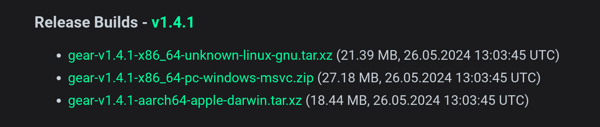
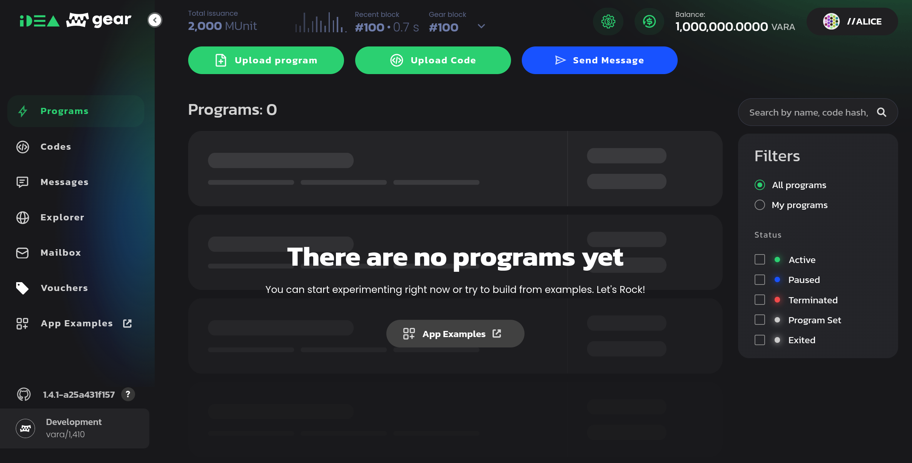
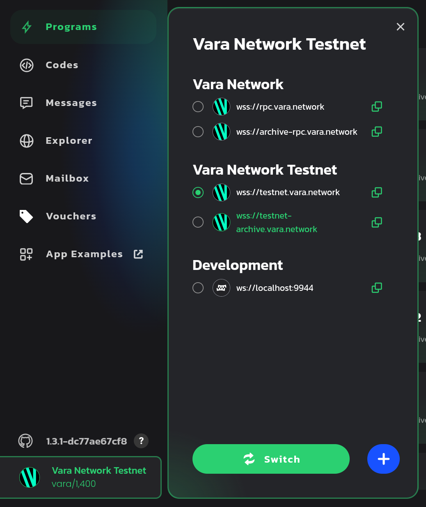

# 开发环境搭建

---

## Checklist

- `wasm-opt` - https://github.com/WebAssembly/binaryen
- `rustup` - https://rustup.rs
- `gear` - https://get.gear.rs

<br/>



---

## Gear CLI

```
$ gear --help
Usage: gear [OPTIONS]
       gear <COMMAND>

Commands:
  key            Key management cli utilities
  build-spec     Build a chain specification
  check-block    Validate blocks
  export-blocks  Export blocks
  export-state   Export the state of a given block into a chain spec
  import-blocks  Import blocks
  purge-chain    Remove the whole chain
  revert         Revert the chain to a previous state
  try-runtime    Try-runtime has migrated to a standalone CLI (<https://github.com/paritytech/try-runtime-cli>). The subcommand exists as a stub and deprecation notice. It will be removed entirely some time after January 2024
  chain-info     Db meta columns information
  gcli           Run gear program cli.
  help           Print this message or the help of the given subcommand(s)
```

---

## 使用示例

```shell
# Vara Network Testnet
$ gear
```

<br/>

```shell
# Vara Network Mainnet
$ gear --chain vara
```

<br/>

```shell
# 生成地址
$ gear key generate
```

<br/>

```shell
# 检查地址
$ gear key inspect
```

---

## 编译模板合约

<pba-flex>

```shell
$ gear gcli new hello-world && cd hello-world
Initialized empty Git repository in /root/hello-world/.git/
Successfully created hello-world!
```

<br/>

```shell
$ cargo build --release
   Compiling template v0.1.0 (/root/hello-world)
    Finished `release` profile [optimized] target(s) in 1.29s
```
<!-- .element: class="fragment" data-fragment-index="1" -->

<br/>

<div>

```shell
$ ls -1 target/wasm32-unknown-unknown/release/
template.meta.txt
template.opt.wasm
template.wasm
```

<br/>

得到 Metadata (`*.meta.txt`) 与优化后的合约二进制 (`*.opt.wasm`)

</div>

<!-- .element: class="fragment" data-fragment-index="2" -->

</pba-flex>

---

## 启动本地节点

```shell
$ gear --dev --rpc-port 9944
2024-06-04 07:51:04 Gear Node    
2024-06-04 07:51:04 ✌️  version 1.4.1-a25a431f157    
2024-06-04 07:51:04 ❤️  by Gear Technologies, 2021-2024    
2024-06-04 07:51:04 📋 Chain specification: Development    
2024-06-04 07:51:04 🏷  Node name: brave-cattle-3351    
2024-06-04 07:51:04 👤 Role: AUTHORITY    
2024-06-04 07:51:04 💾 Database: RocksDb at /tmp/substrate0tBDvz/chains/vara_dev/db/full
...
```

<br/>

RPC: ws://localhost:9944

---

## 连接 RPC 节点



<br/>

https://idea.gear-tech.io/programs?node=ws://localhost:9944

---

<pba-flex>
<pba-cols>

<pba-col>

## 使用公共测试网



</pba-col>

<pba-col>
        
## 获取测试代币


</pba-col>
<!-- .element: class="fragment" data-fragment-index="1" -->

</pba-cols>
</pba-flex>
