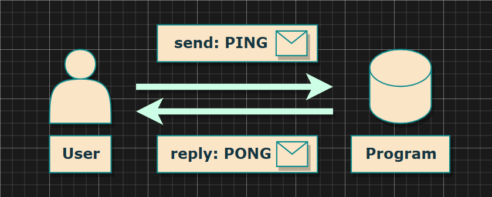
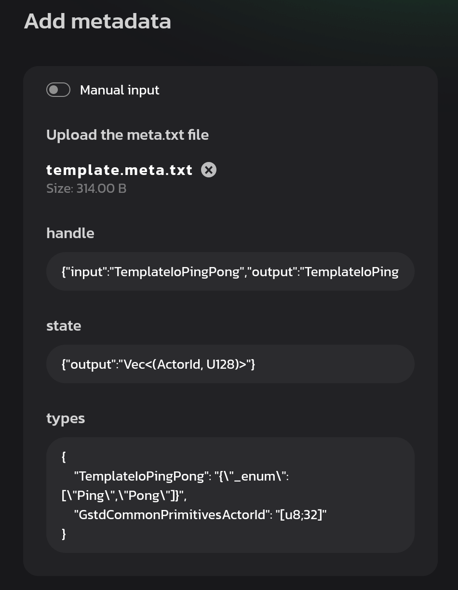
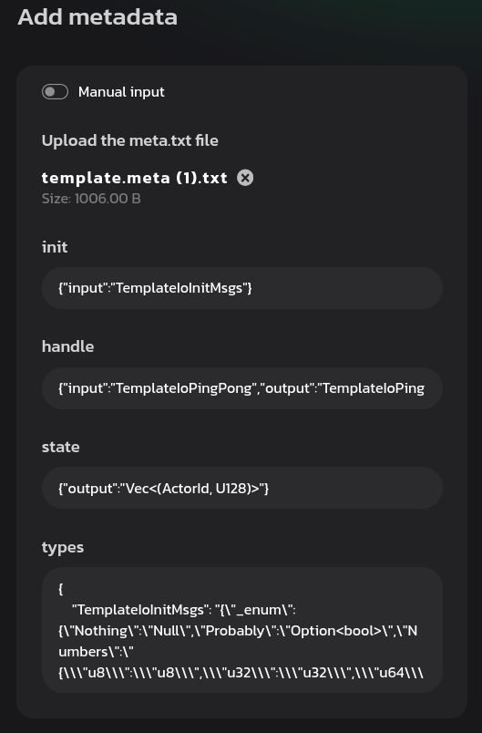

# Metadata

---



https://github.com/varazone/template

---


`./io/src/lib.rs`

```rust
/// `()` means the contract doesn't process & reply messages at the above 
/// written entry point or doesn't implement it.
impl Metadata for ContractMetadata {
    /// I/O types for the `init()` entry point.
    type Init = ();
    /// I/O types for the `handle()` entry point.
    /// Here the [`PingPong`] type is used for both incoming and outgoing messages.
    type Handle = InOut<PingPong, PingPong>;
    /// Types for miscellaneous scenarios.
    type Others = ();
    /// The input type for the `handle_reply()` entry point.
    type Reply = ();
    /// The output type for the `handle_signal()` entry point.
    type Signal = ();
    /// I/O types for the `state()` entry point.
    /// You can also specify just an output ([`Out`]) or input ([`In`](gmeta::In)) type,
    /// if both ([`InOut`]) are expected like here.
    type State = Out<State>;
}
```

---

```rust
/// Replies with [`Pong`](PingPong::Pong) if received [`Ping`](PingPong::Ping).
#[derive(Encode, Decode, TypeInfo, Debug, PartialEq, Eq)]
pub enum PingPong {
    Ping,
    Pong,
}
```

---

Demo: Custom Init Message

```
#[derive(Encode, Decode, TypeInfo, Debug, PartialEq, Eq)]
pub enum InitMsgs {
    Nothing,
    Probably(Option<bool>),
    Numbers {
        u8: u8,
        u32: u32,
        u64: u64,
        u128: u128,
    },
    Struct {
        name: String,
        vector: Vec<u8>,
        slice: [u8; 4],
        address: ActorId,
    },
    Tuple (String, Vec<u8>, [u8; 4], ActorId),
}
```

---

<br/>

<pba-cols>

<pba-col>

Before



</pba-col>

<pba-col>

After



</pba-col>

</pba-cols>

https://idea.gear-tech.io/programs/upload

<!--

Notes:

```
#[derive(Encode, Decode, TypeInfo, Debug, PartialEq, Eq)]
#[codec(crate = gstd::codec)]
#[scale_info(crate = gstd::scale_info)]
pub enum Init {
    Numbers {
        u8: u8,
        u32: u32,
        u64: u64,
        u128: u128,
    },
    Struct {
        name: String,
        vector: Vec<u8>,
        slice: [u8; 4],
        address: ActorId,
    },
    Tuple (String, Vec<u8>, [u8; 4], ActorId),
}

/// `()` means the contract doesn't process & reply messages at the above written entry point or
/// doesn't implement it.
impl Metadata for ContractMetadata {
    /// I/O types for the `init()` entry point.
    type Init = InOut<Init, ()>;
```


build.rs WithMetadata


sails 的 idl 做法

-->