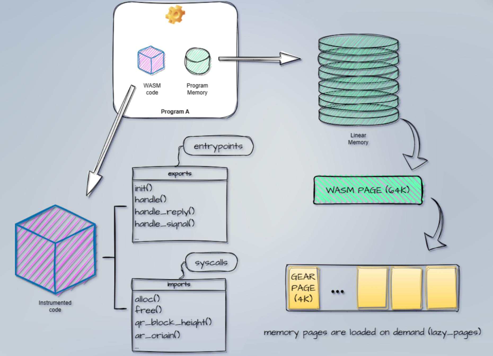

# 状态变量与入口函数

---

## 持久内存




---

## 例子

合约中的状态变量

```rust
// ping pong example
static mut STATE: Option<HashMap<ActorId, u128>> = None;
```

<br/>

`gstd` 标准库

```bash
# https://github.com/gear-tech/gear
gstd/src/config.rs:static mut CONFIG: Config = Config::default();
gstd/src/async_runtime/mod.rs:static mut FUTURES: Option<FuturesMap> = None;
gstd/src/async_runtime/mod.rs:static mut SIGNALS: Option<WakeSignals> = None;
gstd/src/async_runtime/mod.rs:static mut LOCKS: Option<LocksMap> = None;
gstd/src/critical.rs:static mut HOOKS: Option<HooksMap> = None;
```

<br/>

更多例子: https://github.com/gear-foundation/dapps

---

## 消息处理 API

<pba-flex left>

[msg 模块](https://docs.gear.rs/gstd/msg)
```rust
use gstd::msg;
```

[`load`](https://docs.gear.rs/gstd/msg/fn.load.html)

```rust
let payload_string: String = msg::load().expect("Unable to decode `String`");
```

[`send`](https://docs.gear.rs/gstd/msg/fn.send.html)

```rust
let id = msg::source();
msg::send(id, "Hello there", 0).expect("Unable to send message");
```

[`reply`](https://docs.gear.rs/gstd/msg/fn.reply.html)

```rust
msg::reply("PONG", 0).expect("Unable to reply");
```

</pba-flex>

---

## 入口函数

| 函数 | 作用 | 支持的操作 |
| --- | --- | --- |
| init | 初始化状态 | load, send, reply |
| handle | 处理收到的消息 | load, send, reply |
| handle_reply | 处理收到的回复 | load, send |
| state | 查询状态（只读） | load, reply |

---

## init

```
static mut STATE: Option<HashMap<ActorId, u128>> = None;

#[no_mangle]
extern fn init() {
    unsafe { STATE = Some(Default::default()) }
}
```

---

## handle

```
#[no_mangle]
extern fn handle() {
    let payload = msg::load().expect("Failed to load payload");

    if let PingPong::Ping = payload {
        let pingers = unsafe { STATE.as_mut().expect("State isn't initialized") };

        pingers
            .entry(msg::source())
            .and_modify(|ping_count| *ping_count = ping_count.saturating_add(1))
            .or_insert(1);

        msg::reply(PingPong::Pong, 0).expect("Failed to reply from `handle()`");
    }
}
```

---

## state

```
#[no_mangle]
extern fn state() {
    let state = unsafe { STATE.take().expect("State isn't initialized") };
    msg::reply(State::from_iter(state), 0).expect("Failed to reply from `state()`");
}
```


<!--


#[derive(Encode, Decode, TypeInfo, Debug, PartialEq, Eq)]
#[codec(crate = gstd::codec)]
#[scale_info(crate = gstd::scale_info)]
pub enum InitMsgs {
    Nothing,
    Probably(Option<bool>),
    Numbers {
        u8: u8,
        u32: u32,
        u64: u64,
        u128: u128,
    },
    Struct {
        name: String,
        vector: Vec<u8>,
        slice: [u8; 4],
        address: ActorId,
    },
    Tuple(String, Vec<u8>, [u8; 4], ActorId),
}

/// `()` means the contract doesn't process & reply messages at the above written entry point or
/// doesn't implement it.
impl Metadata for ContractMetadata {
    /// I/O types for the `init()` entry point.
    type Init = InOut<InitMsgs, ()>;

InOut<InitMsgs, ()>

In<InitMsgs>

在右侧合约的 metadata 多出了 init.input 的消息类型

根据这个消息类型的定义，左侧自动为我们生成了一个输入框

可以选择想要发送的消息，并且填写消息的内容

如果你想要改变其他入口函数的消息类型，可以使用类似的步骤

-->