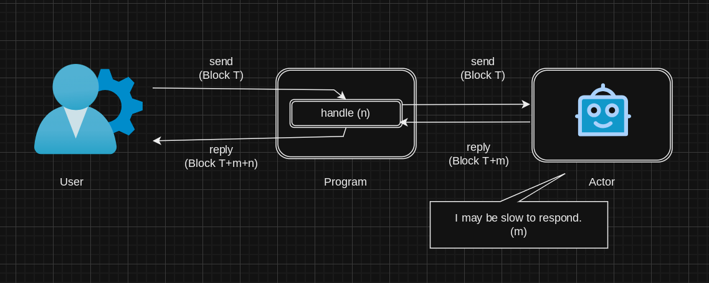
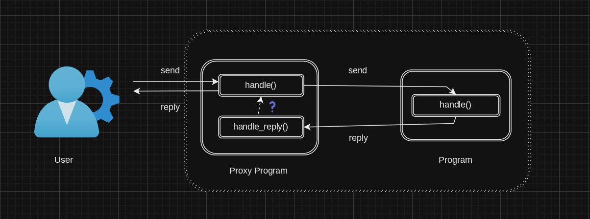
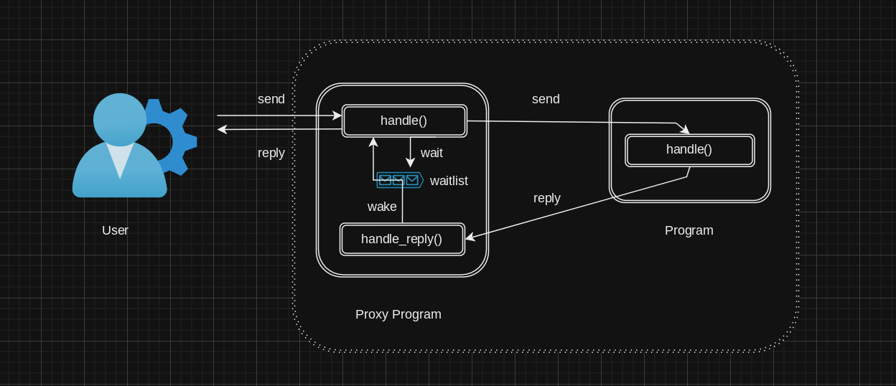
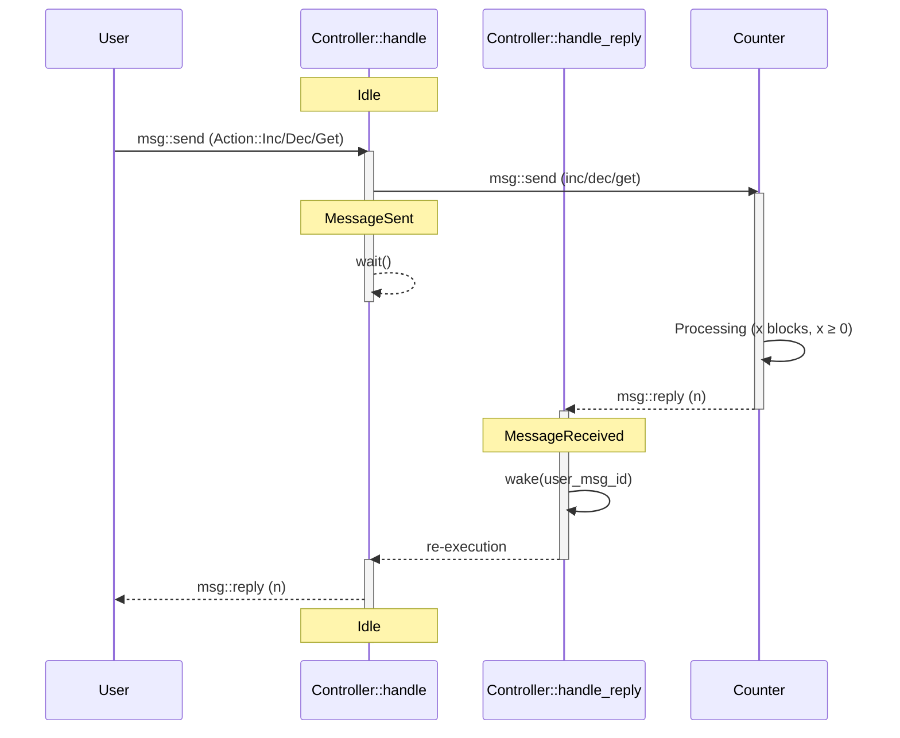

# wait 与 wake

---

## The problem of waiting

 

🤔 如何避免同步等待/轮询?

---

## Waiting without wasting

 

🤔 如何回复最初的消息?

---

## Waiting Queue

 

waitlist - `wait`: 保存待处理的消息, `wake`: 将消息取出重新执行

---

## wait

- `fn wait() -> !` - Pause the current message handling.

 

> Put the current message into the __waiting queue__ to be awakened using the correspondent `wake` function later.

 

https://docs.gear.rs/gstd/exec/fn.wait.html

---

## `!`: the never type

 

> Represents the type of computations which never resolve to any value at all.

> `break`, `continue` and `return` expressions all have type `!`

 

https://doc.rust-lang.org/reference/types/never.html

---

### `std::process`
- `fn exit(code: i32) -> !` - Terminates the current process with the specified exit code.

### `gstd::exec`

- `fn exit(id: ActorId) -> !` - Terminate the execution of a program.
- `fn leave() -> !` - Break the current execution and save the state.
- `fn wait_for(duration: u32) -> !` - Same as wait, but delays handling for a specific number of blocks.
- `fn wait_up_to(duration: u32) -> !` - Same as wait, but delays handling for the maximum number of blocks that can be paid for and doesn’t exceed the given duration.

---

## wake

- `fn wake(message_id: MessageId) -> Result<(), Error>`

 

> Resume previously paused message handling.

> `message_id` specifies a particular message to be taken out of the __waiting queue__ and put into the __processing queue__.

 

https://docs.gear.rs/gstd/exec/fn.wake.html

---

 

使用 wait/wake 后的时序图: User - Controller - Counter