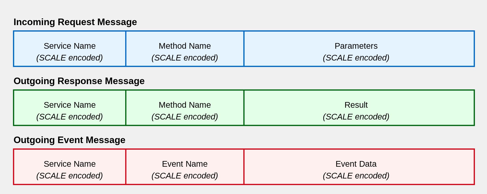

# Sails 框架

---

Sails 是一个旨在简化和优化合约开发体验的库。它主要解决以下几个问题：

- 减少底层样板代码的编写，让开发者可以更专注于解决核心业务问题
- 自动为合约生成 IDL（接口定义语言）文件
- 生成多语言客户端，使得您可以在不同的编程语言和运行环境中与合约进行交互

https://github.com/gear-tech/sails

---

## 核心概念

- Program: 服务的集合
- Service: 独立的业务模块
- IDL: 合约的接口描述
- Event: 服务产生的事件

---

## 消息格式



---

## 合约示例

```
struct Output {
    m1: u32,
    m2: String,
}

#[gservice]
impl MyService {
    pub fn do_something(&mut self, p1: u32, p2: String) -> Output {
        ...
    }
}

#[gprogram]
impl MyProgram {
    pub fn my_service(&self) -> MyService {
        MyService::new()
    }
}
```

---

## IDL 示例

```
constructor {
  New : (name: str, symbol: str, decimals: u8);
};

service Vft {
  Approve : (spender: actor_id, value: u256) -> bool;
  Transfer : (to: actor_id, value: u256) -> bool;
  TransferFrom : (from: actor_id, to: actor_id, value: u256) -> bool;
  query Allowance : (owner: actor_id, spender: actor_id) -> u256;
  query BalanceOf : (account: actor_id) -> u256;
  query Decimals : () -> u8;
  query Name : () -> str;
  query Symbol : () -> str;
  query TotalSupply : () -> u256;

  events {
    Approval: struct { owner: actor_id, spender: actor_id, value: u256 };
    Transfer: struct { from: actor_id, to: actor_id, value: u256 };
  }
};
```

---

## 代币标准参考实现

https://github.com/gear-foundation/standards/