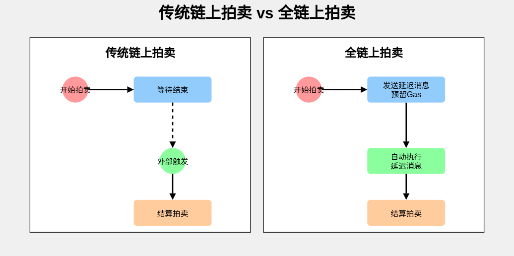

# 延迟消息

---

## 全链上拍卖



<br/>

https://wiki.vara.network/docs/build/delayed-messages

---

## msg::send_delayed

```
fn send_delayed<E: Encode>(
    program: ActorId,
    payload: E,
    value: u128,
    delay: u32
) -> Result<MessageId>
```

> Same as `send`, but sends the message after the `delay` expressed in block count.

- https://docs.gear.rs/gstd/msg/fn.send_delayed.html


---

## Gas 预留 + 延迟消息

<pba-flex center>


- [send_delayed_from_reservation](https://docs.gear.rs/gstd/msg/fn.send_delayed_from_reservation.html)
- [send_bytes_delayed_from_reservation](https://docs.gear.rs/gstd/msg/fn.send_bytes_delayed_from_reservation.html)

</pba-flex>

<br/>

合约使用预留的 Gas 向自身发送延迟消息，触发定时任务